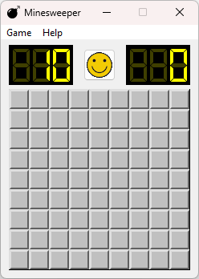
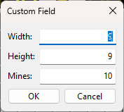
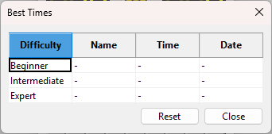

# Minesweeper
This is a simple implementation of the classic Minesweeper game using C++ and wxWidgets. The game allows players to uncover cells on a grid, with the goal of avoiding hidden mines. Players can flag cells they suspect contain mines and try to clear the board without detonating any.

The game includes the ability to specify a custom field size and number of mines.

It also includes a "Best Times" feature that keeps track of the fastest completion times for different field sizes.

